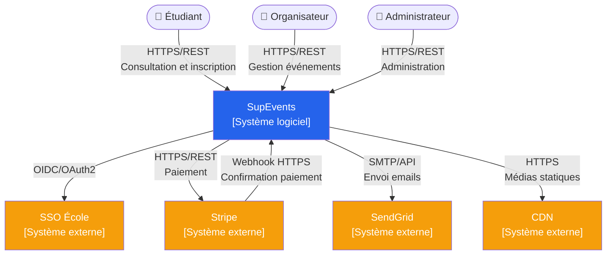
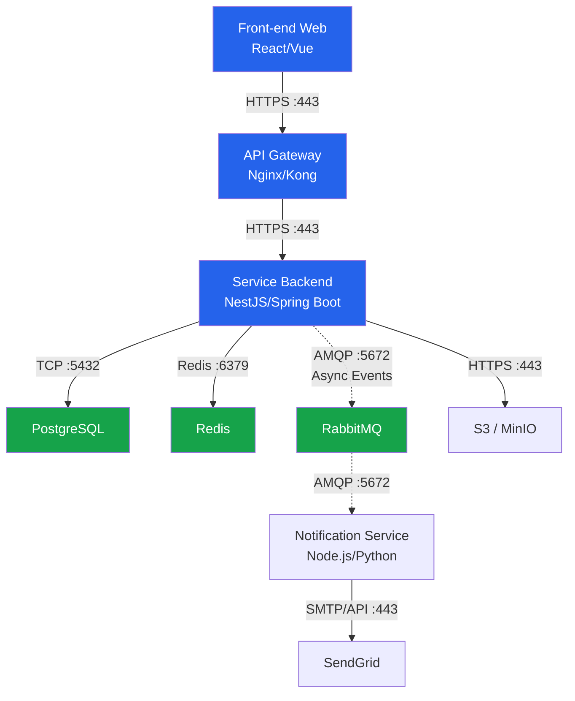

# Vue logique

## Introduction

Cette section présente l’architecture logique de la plateforme SupEvents. Les diagrammes suivants permettent de visualiser les interactions entre les utilisateurs, les systèmes externes et les différents composants internes de l’application.

Ces représentations sont principalement destinées aux développeurs et architectes afin de faciliter la compréhension globale du système ainsi que les choix techniques réalisés.

---

#### Diagramme C4 Context

Ce diagramme présente SupEvents dans son environnement global. Il met en évidence les différents acteurs humains utilisant la plateforme ainsi que les systèmes externes nécessaires au bon fonctionnement de l’application.

Il permet d’identifier rapidement les interactions principales, les protocoles utilisés et les dépendances externes du système.

### Lecture du diagramme

Le diagramme montre que SupEvents centralise toutes les interactions utilisateurs et délègue certaines responsabilités à des services spécialisés externes. Stripe gère les paiements, SendGrid l’envoi des emails transactionnels, tandis que le SSO de l’école prend en charge l’authentification centralisée.

Cette architecture permet de limiter la complexité interne du système tout en s’appuyant sur des solutions reconnues et sécurisées.

---

#### Diagramme C4 Containers

Ce diagramme présente les principaux containers composant l’architecture technique de SupEvents. Il montre les technologies utilisées, les protocoles réseau ainsi que les communications synchrones et asynchrones entre les différents services.

Cette vue est principalement destinée aux développeurs backend, DevOps et architectes techniques.

### Lecture du diagramme

Le backend constitue le cœur de l’architecture et centralise les traitements métier. PostgreSQL assure la persistance des données tandis que Redis optimise les performances via le cache.

RabbitMQ permet de découpler les traitements asynchrones comme l’envoi des notifications, améliorant ainsi la scalabilité et la résilience du système.