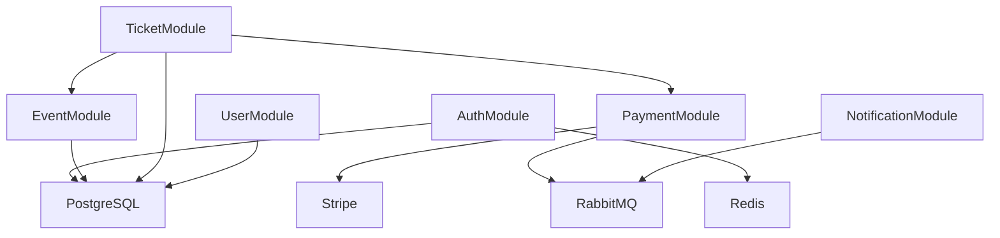
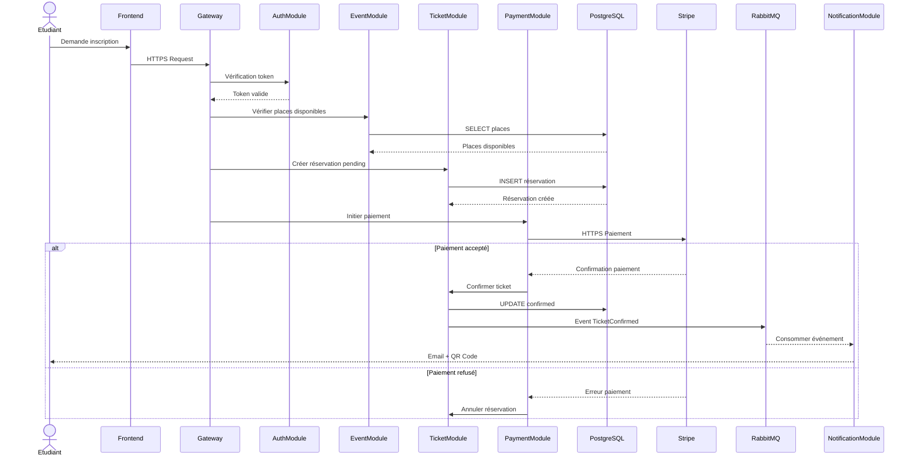
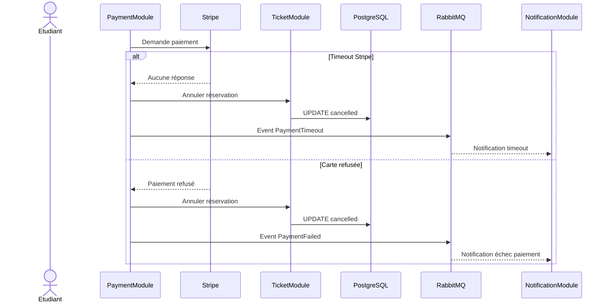

# Vue des processus

## Introduction

Cette section présente les principaux processus métiers de SupEvents à travers plusieurs diagrammes de séquence. Ces diagrammes décrivent les échanges entre les différents composants du système lors des parcours critiques de l’application.

Ils permettent d’analyser les flux synchrones, les traitements asynchrones ainsi que la gestion des erreurs liées au paiement.

---

#### Diagramme de composants — API Backend

Ce diagramme représente les principaux modules internes du backend SupEvents ainsi que leurs dépendances fonctionnelles et techniques.

### Lecture du diagramme

Le diagramme met en évidence le découplage entre les traitements métier et les services externes. Le module Ticket dépend des modules Event et Payment pour vérifier les disponibilités et traiter les paiements.

RabbitMQ permet d’isoler les notifications asynchrones du reste de l’application afin de limiter le couplage entre composants.

---

#### Diagramme de séquence — Inscription à un événement

Ce diagramme décrit le parcours nominal d’un étudiant souhaitant s’inscrire à un événement via SupEvents.

### Lecture du diagramme

Le processus montre une séparation claire entre les traitements synchrones liés à la réservation et les traitements asynchrones liés aux notifications.

L’utilisation de RabbitMQ permet de ne pas bloquer le parcours utilisateur pendant l’envoi des emails transactionnels.

---

#### Diagramme de séquence — Échec de paiement

Ce diagramme représente les différents scénarios d’échec lors du paiement d’un événement.

### Lecture du diagramme

Les deux scénarios d’échec entraînent la libération de la réservation afin d’éviter le blocage inutile des places disponibles.

Le découplage via RabbitMQ permet également de centraliser la gestion des notifications et du logging des incidents de paiement.