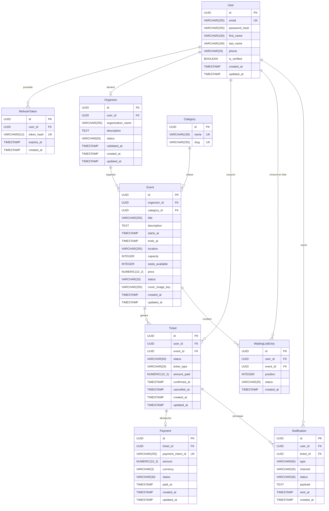

# §6.4 — Vue des données

## Modèle entité-relation

Le modèle de données de SupEvents s'articule autour de huit entités principales. L'entité centrale est `Event`, créée par un `Organizer` (lui-même lié à un `User`) et consommée par des `User` via des `Ticket`. Chaque `Ticket` peut être associé à un `Payment` pour les événements payants. Les `Notification` sont déclenchées par les transitions d'état des tickets et des événements.

Le cœur du modèle repose sur `Event` et `Ticket` comme entités de plein droit. Un `User` n'est jamais relié directement à un `Event` : la relation passe systématiquement par `Ticket`, ce qui permet de tracer l'état de chaque inscription (confirmée, annulée, en attente) et d'associer un `Payment` atomiquement. L'entité `Organizer` dissocie le rôle métier du compte utilisateur, permettant la validation administrative. `WaitingListEntry` gère les inscriptions en surnombre sans modifier la capacité de l'événement.

---

## Dictionnaire de données

### Entité `User`

| Champ | Type | Contraintes | Description | Sensibilité RGPD |
|-------|------|-------------|-------------|-----------------|
| `id` | `UUID` | PK, NOT NULL, DEFAULT gen_random_uuid() | Identifiant unique de l'utilisateur | Non |
| `email` | `VARCHAR(255)` | NOT NULL, UNIQUE | Adresse email de connexion | Oui |
| `password_hash` | `VARCHAR(255)` | NOT NULL | Hash bcrypt du mot de passe | Oui |
| `first_name` | `VARCHAR(100)` | NOT NULL | Prénom | Oui |
| `last_name` | `VARCHAR(100)` | NOT NULL | Nom de famille | Oui |
| `phone` | `VARCHAR(20)` | NULL | Numéro de téléphone | Oui |
| `is_verified` | `BOOLEAN` | NOT NULL, DEFAULT false | Compte vérifié par email | Non |
| `created_at` | `TIMESTAMP` | NOT NULL, DEFAULT now() | Date de création du compte | Non |
| `updated_at` | `TIMESTAMP` | NOT NULL, DEFAULT now() | Date de dernière modification | Non |

> **Stratégie RGPD** : `email`, `first_name`, `last_name`, `phone` sont chiffrés au repos via chiffrement applicatif (AES-256). `password_hash` utilise bcrypt (cost ≥ 12). Durée de rétention : 3 ans après dernière connexion, puis anonymisation (remplacement par UUID aléatoire). Droit à l'effacement : suppression en cascade ou pseudonymisation.

---

### Entité `RefreshToken`

| Champ | Type | Contraintes | Description | Sensibilité RGPD |
|-------|------|-------------|-------------|-----------------|
| `id` | `UUID` | PK, NOT NULL | Identifiant unique du token | Non |
| `user_id` | `UUID` | FK → User.id, NOT NULL | Utilisateur propriétaire | Non |
| `token_hash` | `VARCHAR(512)` | NOT NULL, UNIQUE | Hash SHA-256 du refresh token | Oui |
| `expires_at` | `TIMESTAMP` | NOT NULL | Date d'expiration | Non |
| `created_at` | `TIMESTAMP` | NOT NULL, DEFAULT now() | Date d'émission | Non |

> **Stratégie RGPD** : Le `token_hash` est un hash SHA-256 du token brut — le token lui-même n'est jamais stocké. Durée de rétention : suppression automatique à expiration (TTL géré par job cron).

---

### Entité `Organizer`

| Champ | Type | Contraintes | Description | Sensibilité RGPD |
|-------|------|-------------|-------------|-----------------|
| `id` | `UUID` | PK, NOT NULL | Identifiant unique de l'organisateur | Non |
| `user_id` | `UUID` | FK → User.id, NOT NULL, UNIQUE | Compte utilisateur associé | Non |
| `organization_name` | `VARCHAR(255)` | NOT NULL | Nom de l'organisation | Non |
| `description` | `TEXT` | NULL | Description publique | Non |
| `status` | `VARCHAR(50)` | NOT NULL, CHECK (status IN ('pending','active','revoked')), DEFAULT 'pending' | Statut de validation | Non |
| `validated_at` | `TIMESTAMP` | NULL | Date de validation par un admin | Non |
| `created_at` | `TIMESTAMP` | NOT NULL, DEFAULT now() | Date de création | Non |
| `updated_at` | `TIMESTAMP` | NOT NULL, DEFAULT now() | Date de modification | Non |

---

### Entité `Category`

| Champ | Type | Contraintes | Description | Sensibilité RGPD |
|-------|------|-------------|-------------|-----------------|
| `id` | `UUID` | PK, NOT NULL | Identifiant unique | Non |
| `name` | `VARCHAR(100)` | NOT NULL, UNIQUE | Libellé de la catégorie | Non |
| `slug` | `VARCHAR(100)` | NOT NULL, UNIQUE | Identifiant URL-friendly | Non |

---

### Entité `Event`

| Champ | Type | Contraintes | Description | Sensibilité RGPD |
|-------|------|-------------|-------------|-----------------|
| `id` | `UUID` | PK, NOT NULL | Identifiant unique de l'événement | Non |
| `organizer_id` | `UUID` | FK → Organizer.id, NOT NULL | Organisateur responsable | Non |
| `category_id` | `UUID` | FK → Category.id, NULL | Catégorie thématique | Non |
| `title` | `VARCHAR(255)` | NOT NULL | Titre de l'événement | Non |
| `description` | `TEXT` | NULL | Description détaillée | Non |
| `starts_at` | `TIMESTAMP` | NOT NULL | Date et heure de début | Non |
| `ends_at` | `TIMESTAMP` | NOT NULL, CHECK (ends_at > starts_at) | Date et heure de fin | Non |
| `location` | `VARCHAR(255)` | NOT NULL | Lieu de l'événement | Non |
| `capacity` | `INTEGER` | NOT NULL, CHECK (capacity > 0) | Nombre total de places | Non |
| `seats_available` | `INTEGER` | NOT NULL, CHECK (seats_available >= 0) | Places restantes | Non |
| `price` | `NUMERIC(10,2)` | NOT NULL, DEFAULT 0.00, CHECK (price >= 0) | Prix du ticket (0 = gratuit) | Non |
| `status` | `VARCHAR(20)` | NOT NULL, CHECK (status IN ('draft','published','cancelled','completed')), DEFAULT 'draft' | État de l'événement | Non |
| `cover_image_key` | `VARCHAR(255)` | NULL | Clé S3/MinIO de l'image de couverture | Non |
| `created_at` | `TIMESTAMP` | NOT NULL, DEFAULT now() | Date de création | Non |
| `updated_at` | `TIMESTAMP` | NOT NULL, DEFAULT now() | Date de modification | Non |

---

### Entité `Ticket`

| Champ | Type | Contraintes | Description | Sensibilité RGPD |
|-------|------|-------------|-------------|-----------------|
| `id` | `UUID` | PK, NOT NULL | Identifiant unique du ticket | Non |
| `user_id` | `UUID` | FK → User.id, NOT NULL | Détenteur du ticket | Non |
| `event_id` | `UUID` | FK → Event.id, NOT NULL | Événement concerné | Non |
| `status` | `VARCHAR(50)` | NOT NULL, CHECK (status IN ('pending','confirmed','cancelled','refunded')), DEFAULT 'pending' | État du ticket | Non |
| `ticket_type` | `VARCHAR(20)` | NOT NULL, CHECK (ticket_type IN ('free','paid')), DEFAULT 'free' | Type de ticket | Non |
| `amount_paid` | `NUMERIC(10,2)` | NOT NULL, DEFAULT 0.00 | Montant payé | Non |
| `confirmed_at` | `TIMESTAMP` | NULL | Date de confirmation | Non |
| `cancelled_at` | `TIMESTAMP` | NULL | Date d'annulation | Non |
| `created_at` | `TIMESTAMP` | NOT NULL, DEFAULT now() | Date de création | Non |
| `updated_at` | `TIMESTAMP` | NOT NULL, DEFAULT now() | Date de modification | Non |

---

### Entité `Payment`

| Champ | Type | Contraintes | Description | Sensibilité RGPD |
|-------|------|-------------|-------------|-----------------|
| `id` | `UUID` | PK, NOT NULL | Identifiant unique du paiement | Non |
| `ticket_id` | `UUID` | FK → Ticket.id, NOT NULL, UNIQUE | Ticket associé (1 paiement par ticket) | Non |
| `payment_intent_id` | `VARCHAR(255)` | NOT NULL, UNIQUE | Référence Stripe PaymentIntent | Non |
| `amount` | `NUMERIC(10,2)` | NOT NULL, CHECK (amount > 0) | Montant en centimes / devise | Non |
| `currency` | `VARCHAR(3)` | NOT NULL, DEFAULT 'EUR' | Code ISO 4217 | Non |
| `status` | `VARCHAR(30)` | NOT NULL, CHECK (status IN ('pending','succeeded','failed','refunded')) | État Stripe synchronisé | Non |
| `paid_at` | `TIMESTAMP` | NULL | Date de capture effective | Non |
| `created_at` | `TIMESTAMP` | NOT NULL, DEFAULT now() | Date de création | Non |
| `updated_at` | `TIMESTAMP` | NOT NULL, DEFAULT now() | Date de synchronisation | Non |

> **Rappel CDC** : aucune donnée de carte bancaire (PAN, CVC, date d'expiration) n'est stockée. La conformité PCI-DSS est entièrement déléguée à Stripe. Seul `payment_intent_id` est conservé pour la réconciliation.

---

### Entité `WaitingListEntry`

| Champ | Type | Contraintes | Description | Sensibilité RGPD |
|-------|------|-------------|-------------|-----------------|
| `id` | `UUID` | PK, NOT NULL | Identifiant unique de l'entrée | Non |
| `user_id` | `UUID` | FK → User.id, NOT NULL | Utilisateur en attente | Non |
| `event_id` | `UUID` | FK → Event.id, NOT NULL | Événement concerné | Non |
| `position` | `INTEGER` | NOT NULL, CHECK (position > 0) | Position dans la file | Non |
| `status` | `VARCHAR(20)` | NOT NULL, CHECK (status IN ('waiting','promoted','expired')), DEFAULT 'waiting' | État de l'entrée | Non |
| `created_at` | `TIMESTAMP` | NOT NULL, DEFAULT now() | Date d'inscription en liste | Non |

---

### Entité `Notification`

| Champ | Type | Contraintes | Description | Sensibilité RGPD |
|-------|------|-------------|-------------|-----------------|
| `id` | `UUID` | PK, NOT NULL | Identifiant unique | Non |
| `user_id` | `UUID` | FK → User.id, NOT NULL | Destinataire | Non |
| `ticket_id` | `UUID` | FK → Ticket.id, NULL | Ticket déclencheur (si applicable) | Non |
| `type` | `VARCHAR(50)` | NOT NULL | Type de notification (ticket_confirmed, event_cancelled…) | Non |
| `channel` | `VARCHAR(20)` | NOT NULL, CHECK (channel IN ('email','push','sms')) | Canal d'envoi | Non |
| `status` | `VARCHAR(30)` | NOT NULL, CHECK (status IN ('pending','sent','failed')), DEFAULT 'pending' | État d'envoi | Non |
| `payload` | `TEXT` | NOT NULL | Contenu JSON de la notification | Non |
| `sent_at` | `TIMESTAMP` | NULL | Date d'envoi effectif | Non |
| `created_at` | `TIMESTAMP` | NOT NULL, DEFAULT now() | Date de création | Non |

---

## Stratégie de stockage

**PostgreSQL** héberge la totalité des entités transactionnelles : `User`, `Organizer`, `Event`, `Ticket`, `Payment`, `WaitingListEntry`, `Notification`, `Category`, `RefreshToken`. Le choix du relationnel s'impose ici car l'opération centrale de la plateforme — l'inscription à un événement payant — exige une transaction ACID garantissant l'atomicité entre le décrément de `seats_available`, la création du `Ticket` et la création du `Payment`. Sans contrainte transactionnelle forte, deux utilisateurs simultanés pourraient obtenir le dernier ticket disponible.

**Redis** est utilisé pour trois usages distincts et complémentaires. Premièrement, le stockage des sessions courtes (access token JWT côté client, blocklist de tokens révoqués) avec un TTL aligné sur la durée de validité des tokens. Deuxièmement, les clés d'idempotence pour les opérations de paiement : avant d'appeler Stripe, le service vérifie dans Redis si un `payment_intent_id` existe déjà pour ce `ticket_id`, évitant les doubles débits en cas de retry. Troisièmement, le rate limiting des endpoints sensibles (auth, création de ticket) via le pattern token bucket.

**S3 / MinIO** stocke exclusivement les objets binaires : images de couverture des événements et exports CSV des participants. La convention de nommage est `{bucket}/{entity}/{entity_id}/{timestamp}-{uuid}.{ext}` — par exemple `supevents-media/events/a1b2c3d4.../1715000000-cover.jpg`. Cette convention garantit l'unicité et facilite le cycle de vie (règles de suppression automatique par préfixe).

**RabbitMQ** achemine les événements asynchrones découplant les services : `ticket.confirmed`, `payment.failed`, `event.cancelled`. Ces événements sont publiés par les services métier (TicketService, PaymentService) et consommés par le NotificationService, l'AnalyticsService et le WaitingListService. L'utilisation de RabbitMQ avec des exchanges de type `topic` permet d'ajouter de nouveaux consommateurs sans modifier les producteurs.

---

## Données sensibles RGPD

Les champs personnels identifiants (`email`, `first_name`, `last_name`, `phone`) sont chiffrés au repos en AES-256 et pseudonymisés dans les exports et logs. `password_hash` utilise bcrypt (coût ≥ 12) et n'est jamais transmis hors du service d'authentification. La durée de rétention des données utilisateur est de 3 ans après la dernière activité, après quoi les champs personnels sont remplacés par des valeurs anonymes. Aucune donnée de paiement sensible n'est stockée (délégation PCI-DSS à Stripe). Pour la politique complète, voir **§9 — Conformité RGPD**.
