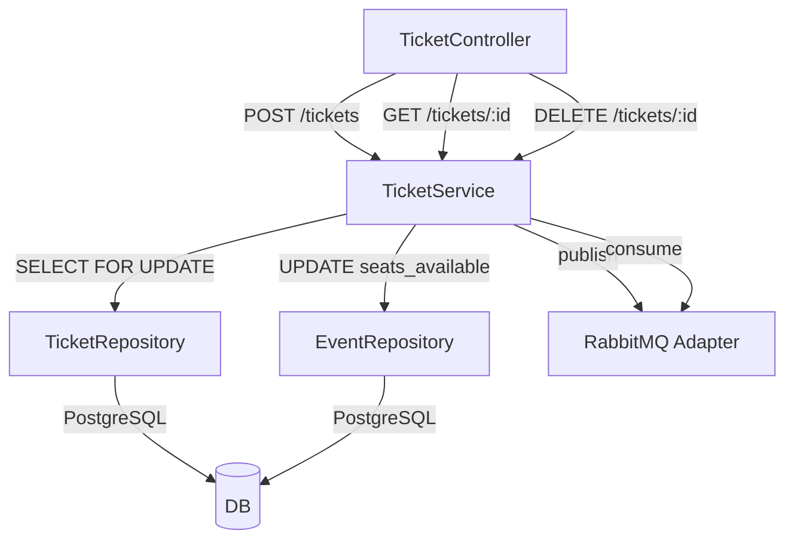
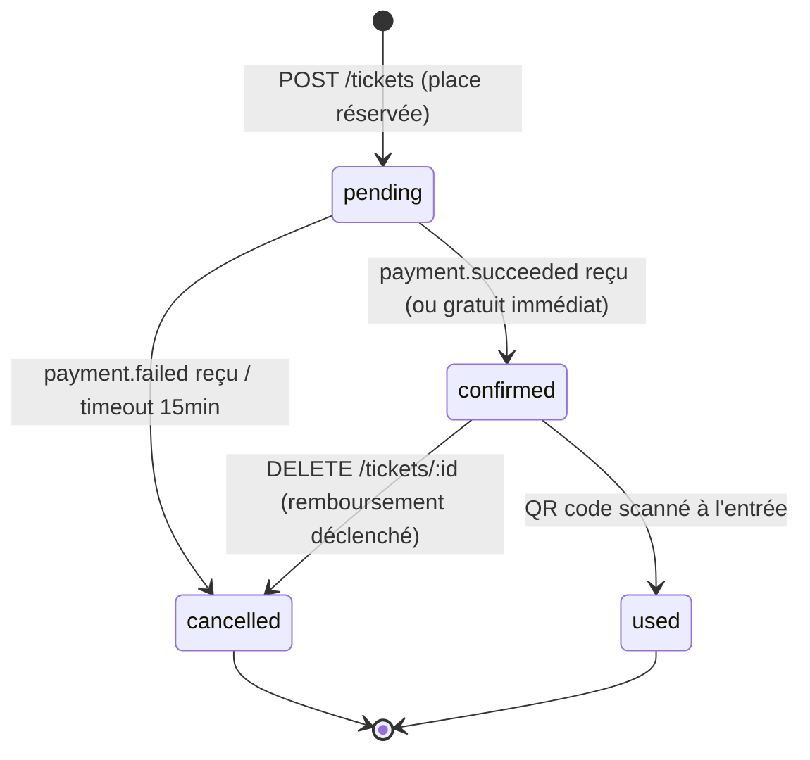
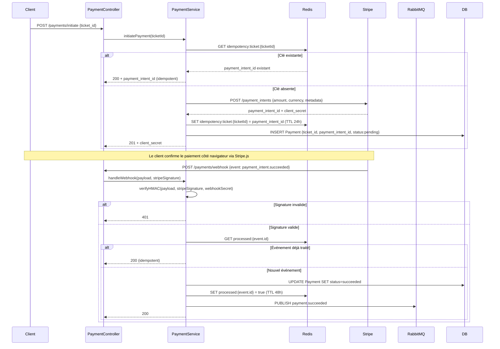
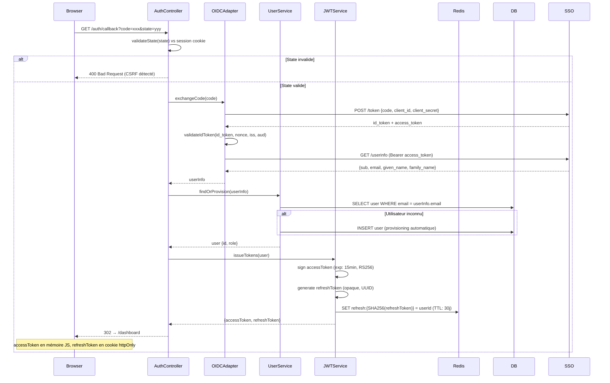

# §7 — Conception détaillée par module

---

## §7.1 — TicketModule

### Responsabilité

Le `TicketModule` gère l'allocation concurrente des places disponibles sur un événement à jauge limitée et orchestre le cycle de vie complet d'un ticket, de sa création à son utilisation ou annulation.

---

### Contrat d'interface

**Endpoints exposés :**

| Méthode | Chemin | Codes retour |
|---------|--------|--------------|
| `POST` | `/api/v1/tickets` | 201, 400, 401, 409, 422, 500 |
| `GET` | `/api/v1/tickets/:id` | 200, 401, 403, 404, 500 |
| `DELETE` | `/api/v1/tickets/:id` | 200, 400, 401, 403, 404, 409, 500 |

**Événements publiés :**

| Événement | Topic |
|-----------|-------|
| `ticket.confirmed` | `tickets.events.v1` (routing key `ticket.confirmed`) |
| `ticket.cancelled` | `tickets.events.v1` (routing key `ticket.cancelled`) |

**Événements consommés :**

| Événement | Topic | Traitement |
|-----------|-------|------------|
| `payment.succeeded` | `payments.events.v1` | Transition du ticket `pending → confirmed`, publication de `ticket.confirmed` |
| `payment.failed` | `payments.events.v1` | Remise en disponibilité de la place (`seats_available + 1`), transition `pending → cancelled` |

**Appels sortants :**

Aucun appel direct vers un système tiers — le TicketModule délègue le paiement au PaymentModule via événement.

---

### Architecture interne



Le `TicketController` reçoit les requêtes HTTP et les délègue au `TicketService`. Ce dernier coordonne l'accès concurrent via un verrou pessimiste (`SELECT FOR UPDATE`) sur la ligne `Event` dans PostgreSQL, garantissant l'atomicité du décrément de `seats_available` et de la création du `Ticket`. Le `RabbitMQ Adapter` gère la publication et la consommation des événements asynchrones. Les deux repositories (`TicketRepository`, `EventRepository`) encapsulent tous les accès SQL.

**Diagramme d'états du ticket :**



---

### Algorithme critique : allocation concurrente sur jauge limitée

```
FUNCTION createTicket(userId, eventId):

  BEGIN TRANSACTION

    -- Verrou pessimiste sur la ligne Event
    event = SELECT * FROM events
            WHERE id = eventId
            FOR UPDATE  -- bloque les lectures concurrentes

    IF event.status != 'published' THEN
      RAISE ERROR 'EVENT_NOT_AVAILABLE' (422)

    IF event.seats_available <= 0 THEN
      RAISE ERROR 'EVENT_SOLD_OUT' (409)

    -- Vérification idempotence : doublon ?
    existing = SELECT * FROM tickets
               WHERE user_id = userId
               AND event_id = eventId
               AND status IN ('pending', 'confirmed')

    IF existing IS NOT NULL THEN
      RAISE ERROR 'TICKET_ALREADY_EXISTS' (409)

    -- Décrément atomique
    UPDATE events SET seats_available = seats_available - 1
    WHERE id = eventId

    -- Création du ticket
    ticket = INSERT INTO tickets (user_id, event_id, status, ticket_type, ...)
             VALUES (userId, eventId, 'pending', ...)

    IF event.price = 0 THEN
      -- Ticket gratuit : confirmation immédiate
      UPDATE tickets SET status = 'confirmed', confirmed_at = now()
      PUBLISH ticket.confirmed → tickets.events.v1
    ELSE
      -- Ticket payant : attente du webhook payment.succeeded
      -- Le ticket reste 'pending' pendant max 15 min
      SCHEDULE timeout_job(ticket.id, delay=15min)

  COMMIT TRANSACTION
  RETURN ticket
```

**Décision documentée :** verrou pessimiste (`SELECT FOR UPDATE`) retenu plutôt que verrou optimiste, car le taux de contention sur la dernière place est élevé lors des ouvertures de billetterie simultanées. Le verrou optimiste engendrerait trop de retries applicatifs et complexifierait la gestion des erreurs côté client. Voir **ADR-001**.

---

### Gestion des erreurs

| Code interne | Cause | Comportement | Code HTTP |
|-------------|-------|--------------|-----------|
| `TICKET_ALREADY_EXISTS` | Un ticket actif (pending ou confirmed) existe déjà pour ce user/event | Retour immédiat sans création, réponse idempotente avec le ticket existant | 409 |
| `EVENT_SOLD_OUT` | `seats_available = 0` au moment du verrou | Rollback de la transaction, inscription en liste d'attente suggérée | 409 |
| `EVENT_NOT_AVAILABLE` | Événement en statut `draft`, `cancelled` ou `completed` | Rollback, message d'erreur explicite | 422 |
| `TICKET_NOT_OWNED` | Tentative d'annulation d'un ticket appartenant à un autre utilisateur | Refus silencieux (même réponse que 404 pour éviter l'énumération) | 403 |
| `TICKET_NOT_CANCELLABLE` | Ticket en statut `used` ou déjà `cancelled` | Refus avec statut courant retourné | 409 |
| `DB_LOCK_TIMEOUT` | Timeout sur le `SELECT FOR UPDATE` (concurrence extrême) | Retry automatique x2, puis 503 avec Retry-After | 503 |

---

### Cas limites

**Cas limite : double-clic sur "S'inscrire"**

L'utilisateur soumet deux requêtes `POST /tickets` quasi-simultanément (double-clic, réseau instable). La vérification d'idempotence dans la transaction (`SELECT ... WHERE status IN ('pending','confirmed')`) garantit qu'un seul ticket est créé. La deuxième requête reçoit un `409 TICKET_ALREADY_EXISTS` avec le ticket existant en corps de réponse, ce qui permet au front de se resynchroniser.

Décision retenue : réponse 409 avec le ticket existant (pas un 200 silencieux) pour que le client distingue "créé maintenant" de "déjà existant".

---

**Cas limite : annulation après paiement capturé**

L'utilisateur annule son ticket alors que le paiement Stripe est déjà en statut `succeeded`. La simple suppression du ticket sans remboursement laisserait l'utilisateur débité sans service.

Décision retenue : `DELETE /tickets/:id` sur un ticket `confirmed` publie un événement `ticket.cancelled` consommé par le `PaymentModule`, qui initie un remboursement Stripe (`refund`) automatique. Le ticket passe en statut `cancelled` uniquement après confirmation du remboursement (ou après délai de 48h si Stripe ne répond pas — alerte DLQ).

---

### Décisions structurantes

- Voir **ADR-001** sur la stratégie de gestion de la concurrence (verrou pessimiste retenu)
- Voir **ADR-003** sur la politique de retry et DLQ des événements asynchrones

---

## §7.2 — PaymentModule

### Responsabilité

Le `PaymentModule` orchestre le cycle de vie des paiements Stripe — création du `PaymentIntent`, réception et vérification des webhooks, gestion de l'idempotence et réconciliation des paiements orphelins — sans jamais stocker de donnée de carte bancaire.

---

### Contrat d'interface

**Endpoints exposés :**

| Méthode | Chemin | Codes retour |
|---------|--------|--------------|
| `POST` | `/api/v1/payments/initiate` | 201, 400, 401, 402, 409, 422, 500 |
| `POST` | `/api/v1/payments/webhook` | 200, 400, 401, 500 |

**Événements publiés :**

| Événement | Topic |
|-----------|-------|
| `payment.succeeded` | `payments.events.v1` (routing key `payment.succeeded`) |
| `payment.failed` | `payments.events.v1` (routing key `payment.failed`) |

**Événements consommés :**

| Événement | Topic | Traitement |
|-----------|-------|------------|
| `ticket.cancelled` | `tickets.events.v1` | Initiation du remboursement Stripe si paiement capturé |

**Appels sortants :**

| Système | Protocole | Finalité |
|---------|-----------|----------|
| Stripe API | HTTPS REST | Création `PaymentIntent`, émission de remboursements |
| Redis | TCP | Stockage clé d'idempotence `payment:{ticket_id}` (TTL 24h) |

---

### Architecture interne



---

### Algorithme critique : réception du webhook Stripe avec idempotence

```
FUNCTION handleWebhook(rawPayload, stripeSignatureHeader):

  -- Étape 1 : vérification HMAC (avant tout parsing)
  isValid = Stripe.verifyWebhookSignature(
    rawPayload,
    stripeSignatureHeader,
    WEBHOOK_SECRET
  )
  IF NOT isValid THEN
    RETURN 401 Unauthorized

  event = JSON.parse(rawPayload)

  -- Étape 2 : idempotence par event.id Stripe
  alreadyProcessed = Redis.GET("processed:" + event.id)
  IF alreadyProcessed THEN
    RETURN 200 OK  -- replay silencieux

  -- Étape 3 : dispatch selon le type d'événement
  SWITCH event.type:

    CASE "payment_intent.succeeded":
      payment = DB.findByPaymentIntentId(event.data.object.id)
      IF payment IS NULL THEN
        -- Paiement orphelin : aucun ticket associé
        LOG WARNING "orphan_payment" + event.data.object.id
        SCHEDULE reconciliation_job(event.data.object.id, delay=1h)
        RETURN 200 OK

      DB.updatePayment(payment.id, status="succeeded", paid_at=now())
      RabbitMQ.publish("payment.succeeded", {payment_id, ticket_id, ...})

    CASE "payment_intent.payment_failed":
      payment = DB.findByPaymentIntentId(event.data.object.id)
      DB.updatePayment(payment.id, status="failed")
      RabbitMQ.publish("payment.failed", {payment_id, ticket_id, failure_code, ...})

  -- Étape 4 : marquer comme traité
  Redis.SET("processed:" + event.id, true, TTL=48h)
  RETURN 200 OK
```

**Décisions documentées :**
- La vérification HMAC est effectuée sur le `rawPayload` brut, avant tout parsing JSON, conformément aux recommandations Stripe. Parser d'abord puis vérifier exposerait à des attaques de canonicalisation.
- L'idempotence par `event.id` (et non par `payment_intent_id`) couvre les cas où Stripe rejoue plusieurs événements distincts pour le même PaymentIntent.
- Voir **ADR-002** sur la stratégie d'idempotence des opérations d'écriture.

---

### Gestion des erreurs

| Code interne | Cause | Comportement | Code HTTP |
|-------------|-------|--------------|-----------|
| `INVALID_WEBHOOK_SIGNATURE` | Header `Stripe-Signature` absent ou HMAC invalide | Rejet immédiat, log d'alerte sécurité | 401 |
| `PAYMENT_ALREADY_INITIATED` | Un `PaymentIntent` actif existe déjà pour ce `ticket_id` (clé Redis présente) | Retour du `payment_intent_id` existant (idempotent) | 200 |
| `STRIPE_UNAVAILABLE` | Timeout ou 5xx de l'API Stripe lors de la création du `PaymentIntent` | Retry x3 (backoff exponentiel 1s/2s/4s), puis 502 Bad Gateway | 502 |
| `ORPHAN_PAYMENT` | Webhook `succeeded` reçu sans `ticket_id` associé en base | Log + job de réconciliation différée (1h), retour 200 pour éviter le retry Stripe | 200 |
| `TICKET_NOT_REFUNDABLE` | Tentative de remboursement sur un ticket `used` ou `cancelled` depuis plus de 7 jours | Refus avec motif explicite, alerte équipe support | 409 |

---

### Cas limites

**Cas limite : webhook Stripe reçu deux fois (replay)**

Stripe garantit une livraison *at-least-once* : un même `payment_intent.succeeded` peut être reçu deux fois en cas de timeout réseau ou de restart du service. Sans protection, le ticket serait confirmé deux fois et deux événements `payment.succeeded` seraient publiés sur RabbitMQ, déclenchant deux emails de confirmation.

Décision retenue : idempotence par `event.id` Stripe stocké dans Redis (TTL 48h). Le deuxième appel retourne immédiatement `200 OK` sans aucun effet de bord.

---

**Cas limite : paiement capturé sans ticket associé (paiement orphelin)**

Un bug réseau ou un crash entre la création du `PaymentIntent` et l'insertion en base peut aboutir à un paiement Stripe réussi sans enregistrement `Payment` correspondant. L'utilisateur est débité mais son ticket reste `pending` indéfiniment.

Décision retenue : le handler webhook détecte ce cas (`payment IS NULL`), logge un warning `orphan_payment` et planifie un job de réconciliation différée (1h). Ce job interroge Stripe pour récupérer les métadonnées du `PaymentIntent` (dont le `ticket_id` stocké dans `metadata`) et reconstitue l'enregistrement `Payment` manquant, puis publie `payment.succeeded`.

---

### Décisions structurantes

- Voir **ADR-002** sur la stratégie d'idempotence (clé serveur Redis retenue)
- Voir **ADR-003** sur la politique de retry et DLQ

---

## §7.3 — AuthModule

### Responsabilité

Le `AuthModule` gère l'authentification des utilisateurs via le SSO école (protocole OIDC), émet les tokens JWT applicatifs, maintient le cycle de vie des refresh tokens et propage le contexte d'identité (rôle, userId) à l'ensemble des modules via middleware.

---

### Contrat d'interface

**Endpoints exposés :**

| Méthode | Chemin | Codes retour |
|---------|--------|--------------|
| `GET` | `/api/v1/auth/callback` | 302, 400, 401, 500 |
| `POST` | `/api/v1/auth/refresh` | 200, 401, 403, 429, 500 |
| `POST` | `/api/v1/auth/logout` | 204, 401, 500 |

**Événements publiés :** Aucun — l'AuthModule est un module transverse sans publication asynchrone.

**Événements consommés :** Aucun.

**Appels sortants :**

| Système | Protocole | Finalité |
|---------|-----------|----------|
| SSO École (OIDC Provider) | HTTPS (OIDC) | Échange du code d'autorisation contre les tokens OIDC, récupération du `userinfo` |
| Redis | TCP | Stockage des refresh tokens (hash SHA-256), blocklist des access tokens révoqués |

---

### Architecture interne



---

### Algorithme critique : flow OIDC complet avec validation du state

```
FUNCTION handleCallback(code, state, sessionCookie):

  -- Étape 1 : validation CSRF via le paramètre state
  expectedState = Session.get(sessionCookie, "oidc_state")
  IF state != expectedState THEN
    RAISE ERROR 'INVALID_STATE' (400)  -- attaque CSRF potentielle

  Session.delete(sessionCookie, "oidc_state")  -- usage unique

  -- Étape 2 : échange du code d'autorisation
  tokens = OIDCProvider.exchangeCode(
    code,
    redirect_uri = APP_CALLBACK_URL,
    client_id    = OIDC_CLIENT_ID,
    client_secret = OIDC_CLIENT_SECRET
  )
  IF tokens.error THEN
    RAISE ERROR 'OIDC_EXCHANGE_FAILED' (401)

  -- Étape 3 : validation de l'id_token
  claims = JWT.verify(
    tokens.id_token,
    publicKey = OIDCProvider.getJWKS(),
    options = {
      issuer   : EXPECTED_ISSUER,
      audience : OIDC_CLIENT_ID,
      nonce    : Session.get(sessionCookie, "oidc_nonce")
    }
  )

  -- Étape 4 : récupération du profil utilisateur
  userInfo = OIDCProvider.getUserInfo(tokens.access_token)

  -- Étape 5 : provisioning si premier login
  user = DB.findByEmail(userInfo.email)
  IF user IS NULL THEN
    user = DB.insert({
      email      : userInfo.email,
      first_name : userInfo.given_name,
      last_name  : userInfo.family_name,
      role       : 'student',          -- rôle par défaut
      is_verified: true                -- vérifié par le SSO école
    })

  -- Étape 6 : émission des tokens applicatifs
  accessToken  = JWT.sign({sub: user.id, role: user.role}, exp="15min", alg="RS256")
  refreshToken = UUID.generate()
  Redis.SET("refresh:" + SHA256(refreshToken), user.id, TTL=30days)

  RETURN {accessToken, refreshToken}
```

**Décisions documentées :**
- Le `state` est validé en usage unique (supprimé de la session après vérification) pour prévenir les attaques CSRF et les replays.
- L'`accessToken` a une durée de vie courte (15 min) pour limiter l'exposition en cas de révocation côté SSO — le SSO école ne notifiant pas les révocations en temps réel.
- Le `refreshToken` est stocké sous forme de hash SHA-256 dans Redis : le token brut n'est jamais persisté. Voir **ADR-002** pour la justification.

---

### Gestion des erreurs

| Code interne | Cause | Comportement | Code HTTP |
|-------------|-------|--------------|-----------|
| `INVALID_STATE` | Paramètre `state` du callback ne correspond pas à la session | Rejet, log d'alerte sécurité (CSRF potentiel), invalidation de la session | 400 |
| `OIDC_EXCHANGE_FAILED` | Le SSO école rejette le code (expiré, déjà utilisé) | Redirection vers la page de login avec message d'erreur | 401 |
| `INVALID_ID_TOKEN` | Signature, `iss`, `aud` ou `nonce` invalides | Rejet immédiat, log de sécurité | 401 |
| `REFRESH_TOKEN_INVALID` | Token absent, expiré, ou hash non trouvé dans Redis | Déconnexion forcée côté client | 401 |
| `SSO_UNAVAILABLE` | Timeout sur les endpoints OIDC de l'école | Retry x2, puis 502 avec page d'erreur de maintenance | 502 |
| `REFRESH_RATE_LIMITED` | Plus de 10 tentatives de refresh en 1 min pour un même IP | 429 avec `Retry-After: 60` | 429 |

---

### Cas limites

**Cas limite : token JWT révoqué côté SSO mais encore valide localement**

Le SSO école révoque la session d'un utilisateur (ex : changement de mot de passe, exclusion), mais l'`accessToken` applicatif émis il y a 5 minutes est encore valide (exp dans 10 min). L'utilisateur peut continuer à accéder à l'API pendant cette fenêtre.

Décision retenue : durée de vie courte de l'access token (15 min) acceptée comme compromis entre sécurité et performance. En cas de révocation urgente (compte compromis), un administrateur peut inscrire le `jti` de l'access token dans la blocklist Redis (TTL = durée de vie résiduelle du token). Le middleware de validation vérifie la blocklist à chaque requête.

---

**Cas limite : premier login d'un utilisateur inconnu**

Un étudiant de l'école se connecte pour la première fois via le SSO. Aucun compte `User` n'existe en base. Sans provisioning automatique, l'authentification échoue malgré des credentials SSO valides.

Décision retenue : provisioning automatique au premier login (`INSERT user` avec les données du `userinfo` OIDC). Le rôle attribué par défaut est `student`. L'accès au rôle `organizer` requiert une validation administrative explicite (voir `UserModule`). Cette approche évite toute gestion de compte séparée et délègue entièrement l'identité à l'école.

---

### Décisions structurantes

- Voir **ADR-002** sur le choix du pattern d'authentification (JWT stateless retenu)
- Voir **ADR-003** sur la politique de retry des appels SSO
