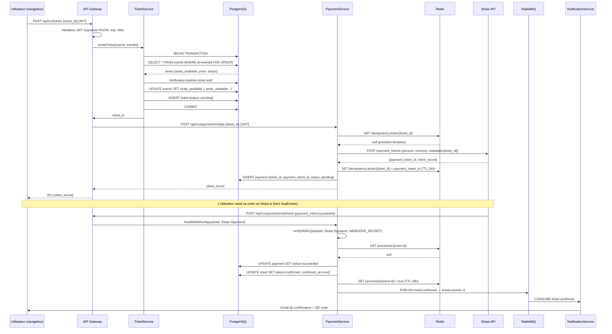
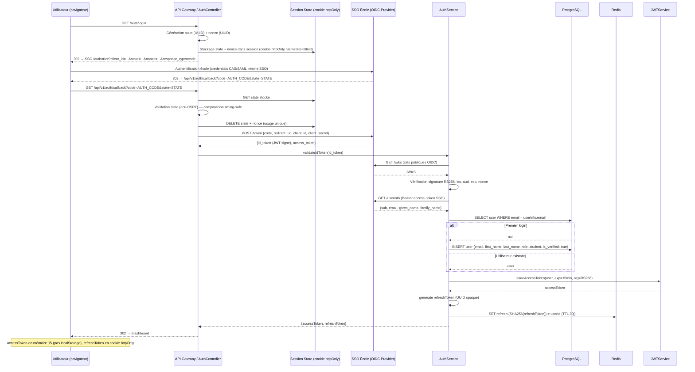

# §9 — Exigences transverses

---

## §9.1 — Sécurité (analyse STRIDE)

### §9.1.1 — Flux *Inscription payante*

#### Description du flux

Le flux d'inscription payante est le plus critique de SupEvents car il croise sécurité des paiements, cohérence des données et contraintes de concurrence. L'utilisateur authentifié (JWT RS256, durée de vie 15 min) soumet une demande d'inscription via `POST /api/v1/tickets`. Le `TicketService` acquiert un verrou pessimiste (`SELECT FOR UPDATE`) sur la ligne `Event` pour garantir l'atomicité du décrément de `seats_available` — aucune survente n'est possible même sous forte concurrence. Une vérification d'idempotence bloque les doubles réservations. Le `PaymentService` crée ensuite un `PaymentIntent` Stripe, en stockant une clé d'idempotence dans Redis pour éviter les doubles débits en cas de retry réseau. La saisie de la carte se fait exclusivement via Stripe.js dans le navigateur : aucune donnée de carte ne transite par nos serveurs, garantissant la conformité PCI-DSS. La confirmation arrive via webhook Stripe, authentifié par signature HMAC-SHA256 (header `Stripe-Signature`) — et non par JWT. L'idempotence du webhook est assurée par stockage de l'`event.id` Stripe dans Redis (TTL 48h), couvrant les replays. Après mise à jour des statuts en base, l'événement `ticket.confirmed` est publié sur RabbitMQ, découplant la notification de l'inscription.

#### Tableau STRIDE

| Menace | Risque identifié | Mesure de défense retenue |
|--------|-----------------|--------------------------|
| **S — Spoofing** | Un attaquant forge une requête `POST /tickets` en se faisant passer pour un utilisateur légitime afin de réserver des places à sa place | Validation obligatoire du JWT RS256 signé par le serveur d'authentification sur chaque requête ; vérification de l'`exp`, de l'`iss` et du `sub` dans le middleware d'authentification avant tout traitement |
| **T — Tampering** | Un attaquant intercepte le webhook Stripe et modifie le payload pour confirmer un ticket sans paiement réel, ou altère le montant du `PaymentIntent` | Signature HMAC-SHA256 vérifiée via le secret webhook Stripe et l'en-tête `Stripe-Signature` sur le rawPayload brut avant tout parsing ; montant du `PaymentIntent` défini côté serveur (jamais côté client) |
| **R — Repudiation** | Un utilisateur conteste ne pas avoir souscrit un ticket ou un paiement ; un organisateur conteste le nombre de places vendues | Audit log immuable horodaté sur chaque transition d'état (`pending → confirmed → cancelled`) ; stockage du `payment_intent_id` Stripe permettant la réconciliation avec les reçus Stripe |
| **I — Information Disclosure** | Les métadonnées du `PaymentIntent` Stripe contenant le `ticket_id` et le `user_id` sont exposées dans les logs ou les réponses d'erreur | Masquage des champs sensibles dans les logs (pas de logging du `client_secret`) ; le `client_secret` Stripe n'est jamais stocké en base ni loggé ; réponses d'erreur RFC 7807 sans stack trace en production |
| **D — Denial of Service** | Un attaquant soumet massivement des `POST /tickets` pour épuiser `seats_available` sans payer, bloquant les vrais utilisateurs pendant le délai de timeout (15 min) | Rate limiting Redis token-bucket : 5 créations de tickets par minute par utilisateur authentifié ; timeout automatique des tickets `pending` après 15 min (job cron) libérant les places ; `lock_timeout` PostgreSQL à 2s évitant les transactions bloquantes prolongées |
| **E — Elevation of Privilege** | Un utilisateur avec le rôle `student` tente d'accéder aux endpoints organisateur (`/organizer/events/:id/participants`) en manipulant son JWT | Vérification du claim `role` dans le JWT à chaque requête côté serveur ; middleware de guard par rôle indépendant du middleware d'authentification ; les rôles sont assignés en base et ne peuvent être auto-élevés |

---

### §9.1.2 — Flux *Authentification SSO*

#### Description du flux

Le flux d'authentification SSO délègue entièrement la vérification des credentials à l'OIDC provider de l'école, SupEvents n'ayant jamais accès au mot de passe de l'utilisateur. La protection CSRF repose sur le paramètre `state` (UUID aléatoire), généré à l'initiation et validé en usage unique lors du callback par comparaison timing-safe, stocké dans un cookie `httpOnly` et `SameSite=Strict`. Le `nonce` prévient les attaques de replay sur l'`id_token`. La validation de l'`id_token` repose sur les clés publiques JWKS du SSO (rotation possible sans redéploiement) et vérifie `iss`, `aud`, `exp` et `nonce`. Le provisioning automatique au premier login attribue le rôle `student` par défaut. L'`accessToken` applicatif (RS256, 15 min) est maintenu en mémoire JavaScript côté client pour réduire la surface XSS ; le `refreshToken` opaque est stocké sous forme de hash SHA-256 dans Redis (le token brut n'est jamais persisté) et transmis uniquement via cookie `httpOnly`. Cette architecture minimise les risques liés aux tokens longue durée tout en offrant une expérience sans re-login fréquent.

#### Tableau STRIDE

| Menace | Risque identifié | Mesure de défense retenue |
|--------|-----------------|--------------------------|
| **S — Spoofing** | Un attaquant forge un callback OIDC avec un `code` valide intercepté et un `state` arbitraire pour s'authentifier à la place d'un utilisateur légitime | Validation du `state` par comparaison timing-safe (`crypto.timingSafeEqual`) entre la valeur du callback et celle stockée dans le cookie de session ; invalidation immédiate après usage unique |
| **T — Tampering** | Un attaquant modifie l'`id_token` OIDC en transit pour élever ses droits (changer l'`email` ou le `sub`) | Vérification de la signature RS256 de l'`id_token` contre les clés publiques JWKS du SSO école ; tout `id_token` dont la signature est invalide est rejeté avec un log de sécurité |
| **R — Repudiation** | Un utilisateur conteste s'être connecté à une heure donnée ou nie l'émission d'un refresh token | Audit log horodaté de chaque émission de token (userId, IP, user-agent, timestamp) ; le hash SHA-256 du refresh token en Redis constitue une preuve d'émission |
| **I — Information Disclosure** | Le `refreshToken` en clair est exposé dans les logs serveur ou volé via XSS s'il était stocké en localStorage | Le `refreshToken` est transmis exclusivement via cookie `httpOnly` + `SameSite=Strict` (inaccessible au JavaScript) ; seul le SHA-256 du token est stocké en Redis (le token brut n'est jamais persisté ni loggé) |
| **D — Denial of Service** | Un attaquant soumet massivement des appels à `POST /auth/refresh` pour saturer Redis et invalider les sessions légitimes | Rate limiting Redis : 10 tentatives de refresh par minute par IP ; `Retry-After` retourné en header sur les 429 ; TTL Redis sur les clés de rate limiting évite l'accumulation mémoire |
| **E — Elevation of Privilege** | Un utilisateur avec le rôle `student` modifie son `accessToken` JWT pour ajouter le rôle `organizer` et accéder aux endpoints d'administration | L'`accessToken` est signé RS256 avec la clé privée du serveur (jamais exposée) ; toute modification invalide la signature ; le rôle est relu depuis le token signé côté serveur et ne peut être auto-élevé |

---

## §9.2 — Performance

### ENF-01 — Latence catalogue et inscription

| | Détail |
|-|--------|
| **Objectif mesurable** | `GET /api/v1/events` : p95 < 200 ms, p99 < 500 ms sous charge de 200 utilisateurs simultanés. `POST /api/v1/tickets` : p95 < 500 ms, p99 < 1 000 ms sous charge de 500 utilisateurs simultanés. Mesuré en production sur une fenêtre glissante de 5 minutes. |
| **Solution technique** | Index PostgreSQL composite sur `(status, starts_at, category_id)` pour la liste des événements publiés. Cache Redis sur le résultat de `GET /events` avec TTL 30s (invalidé à chaque création/modification d'événement). Pagination côté serveur (max 20 items/page, curseur keyset). Pool de connexions PostgreSQL (PgBouncer, mode transaction, pool size = 20). Verrou pessimiste `SELECT FOR UPDATE` borné par `lock_timeout = 2s` pour éviter les transactions longues bloquantes. |
| **Composants impactés** | `EventModule` (lecture catalogue), `TicketModule` (allocation concurrente), `AuthModule` (validation JWT sur chaque requête) |
| **Méthode de vérification** | Outil : k6. Scénario : ramp-up 0→500 utilisateurs en 30s, maintien 2 min, ramp-down. Fréquence : exécution à chaque merge sur `main` (CI GitHub Actions). Seuil d'alerte production : p95 > 350 ms pendant 2 min consécutives → alerte PagerDuty. |

---

### ENF-02 — Disponibilité mensuelle

| | Détail |
|-|--------|
| **Objectif mesurable** | Disponibilité ≥ 99,5 % par mois calendaire, mesurée sur l'endpoint de healthcheck `GET /api/v1/health` depuis 3 régions. **Budget d'erreur mensuel : 99,5 % → indisponibilité tolérée = 0,5 % × 43 200 min = 216 minutes soit 3 heures 36 minutes par mois.** |
| **Solution technique** | Déploiement multi-instance derrière un load balancer (minimum 2 instances actives en permanence). Health checks actifs (intervalle 10s, seuil d'échec = 2 checks consécutifs). Restart automatique des conteneurs en échec (Docker restart policy `always`). Base de données PostgreSQL avec réplica en lecture (failover automatique < 30s). Redis en mode Sentinel (2 réplicas, failover automatique). |
| **Composants impactés** | Ensemble de la plateforme ; responsabilité transverse portée par l'infrastructure et le `AuthModule` (sessions Redis) |
| **Méthode de vérification** | Monitoring continu via UptimeRobot (check toutes les 60s, 3 localisations). Rapport mensuel de disponibilité généré automatiquement. Seuil d'alerte : indisponibilité cumulée > 180 min dans le mois → alerte équipe + revue post-mortem obligatoire. |

---

### ENF-03 — Capacité pic d'inscriptions concurrentes

| | Détail |
|-|--------|
| **Objectif mesurable** | 500 utilisateurs simultanés soumettant un `POST /api/v1/tickets` sur le même événement sans erreur fonctionnelle (0 survente, 0 doublon) et avec un taux d'erreur HTTP < 1 % (hors 409 métier attendus). Temps de réponse p95 < 500 ms. |
| **Solution technique** | Verrou pessimiste PostgreSQL (`SELECT FOR UPDATE` + `lock_timeout = 2s`) garantissant l'atomicité sans survente. Pool de connexions PgBouncer dimensionné pour absorber 500 connexions simultanées (pool size configuré à 50, mode transaction). Rate limiting par utilisateur (5 req/min) limitant les requêtes abusives sans bloquer les utilisateurs légitimes. Réponse 409 immédiate et idempotente pour les doublons (pas de retry en boucle côté serveur). |
| **Composants impactés** | `TicketModule` (verrou et allocation), `PaymentModule` (création PaymentIntent Stripe), PostgreSQL (pool de connexions) |
| **Méthode de vérification** | Outil : k6 avec scénario de spike : 500 VU en parallèle sur `POST /tickets` pour un même `event_id` avec `seats_available = 100`. Vérification post-test : exactement 100 tickets `confirmed`, 400 tickets en 409, 0 tickets en erreur 5xx. Exécution : avant chaque mise en production et après tout changement sur `TicketModule`. |

---

## §9.3 — RGPD

### a) Registre des traitements (extrait)

| Donnée personnelle | Finalité | Base légale | Durée de rétention |
|--------------------|----------|-------------|-------------------|
| Email | Authentification, communication transactionnelle (confirmation de ticket, rappel d'événement) | Exécution du contrat (Art. 6.1.b RGPD) | 3 ans après la dernière connexion, puis anonymisation |
| Nom et prénom | Personnalisation des communications, identification dans le tableau de bord organisateur | Exécution du contrat (Art. 6.1.b RGPD) | 3 ans après la dernière connexion, puis anonymisation |
| Identifiant SSO école (`sub` OIDC) | Liaison du compte SupEvents au compte école, prévention des doublons de compte | Exécution du contrat (Art. 6.1.b RGPD) | Durée de vie du compte SupEvents |
| Historique des inscriptions (ticket_id, event_id, statut, date) | Accès utilisateur à ses billets, tableau de bord organisateur, support client | Exécution du contrat (Art. 6.1.b RGPD) | 5 ans (obligation comptable pour les tickets payants), puis anonymisation |
| Référence Stripe (`payment_intent_id`, `customer_id`) | Réconciliation des paiements, émission de remboursements, conformité comptable | Obligation légale (Art. 6.1.c RGPD — conservation des pièces comptables) | 10 ans (délai légal comptable français) |
| Numéro de téléphone | Communication d'urgence optionnelle (annulation d'événement de dernière minute) | Consentement (Art. 6.1.a RGPD) | Durée de vie du compte, supprimé sur retrait du consentement |
| Adresse IP de connexion | Sécurité (détection d'intrusion, rate limiting, audit log) | Intérêt légitime (Art. 6.1.f RGPD) | 12 mois, puis purge automatique |

---

### b) Mécanismes de protection transverses

- **Chiffrement TLS 1.3 en transit** — toutes les communications entre le navigateur et l'API Gateway, entre les services internes, et entre SupEvents et Stripe/SendGrid/SSO école, sont chiffrées avec TLS 1.3 (certificats Let's Encrypt renouvelés automatiquement).
- **Chiffrement AES-256 au repos** — les colonnes `email`, `first_name`, `last_name`, `phone` de la table `users` sont chiffrées au niveau applicatif avant insertion en base (chiffrement de colonne, pas seulement chiffrement du volume disque).
- **Hashage des refresh tokens** — le `refreshToken` opaque est stocké dans Redis uniquement sous forme de hash SHA-256 ; le token brut n'est jamais persisté, limitant l'impact d'une compromission de Redis.
- **Gestion des secrets via variables d'environnement injectées** — les secrets (clé privée JWT, secret webhook Stripe, credentials SSO, DSN PostgreSQL) sont injectés via variables d'environnement au démarrage des conteneurs et ne sont jamais écrits dans le code source ni dans les images Docker. En production, ils sont gérés via un gestionnaire de secrets dédié (HashiCorp Vault ou équivalent).
- **Séparation stricte des environnements** — les bases de données de développement, staging et production sont physiquement séparées, avec des credentials distincts. Aucune donnée de production n'est accessible en environnement de développement.
- **Audit log horodaté et immuable** — chaque accès aux données personnelles (lecture du profil, export, exercice d'un droit RGPD) est tracé avec userId, IP, timestamp et action dans un log append-only distinct de la base principale (écriture uniquement, pas de UPDATE/DELETE).
- **Pseudonymisation dans les exports et logs** — les exports CSV organisateurs et les logs applicatifs n'exposent pas l'email en clair : le `user_id` (UUID) est utilisé comme identifiant de substitution. La correspondance UUID ↔ email n'est accessible qu'aux administrateurs via une interface dédiée avec authentification renforcée.

---

### c) Procédures liées aux droits des personnes

#### Droit d'accès (Art. 15 RGPD)

**Qui déclenche :** l'utilisateur, via un formulaire authentifié dans son espace personnel (`/account/data-export`).

**Qui exécute :** job automatisé (`UserModule` — `DataExportService`), sans intervention manuelle pour les cas standard.

**Délai contractuel :** export disponible dans les 72 heures suivant la demande (délai légal : 1 mois).

**Contenu de l'export :** fichier ZIP contenant (a) un JSON avec le profil complet (`email`, `first_name`, `last_name`, `phone`, `role`, `created_at`), (b) un CSV de l'historique complet des tickets avec statut et montant, (c) un CSV des notifications envoyées. Les `payment_intent_id` Stripe sont inclus ; aucune donnée de carte bancaire n'est disponible (déléguée à Stripe).

**Livraison :** lien de téléchargement sécurisé (URL signée S3, TTL 48h) envoyé par email à l'adresse du compte.

**Traces conservées :** date de la demande, date de génération, date de téléchargement effectif, loggés dans l'audit log immuable.

---

#### Droit à l'oubli (Art. 17 RGPD)

**Qui déclenche :** l'utilisateur, via une action explicite dans son espace personnel (`/account/delete`), ou un administrateur sur demande écrite.

**Qui exécute :** administrateur SupEvents, avec validation manuelle obligatoire avant exécution (protection contre les suppressions accidentelles).

**Délai contractuel :** traitement dans les 30 jours suivant la demande.

**Procédure :**

1. Vérification des blocages légaux : si l'utilisateur a des tickets payants avec `confirmed_at` dans les 10 dernières années, la suppression complète est impossible (obligation de conservation comptable).
2. **Résolution de la tension comptable** : les champs nominatifs (`email`, `first_name`, `last_name`, `phone`) sont remplacés par un pseudonyme stable généré à partir d'un UUID aléatoire (ex : `user_a1b2c3d4@deleted.supevents.io`). Le `payment_intent_id` Stripe et les montants sont conservés intacts pour la conformité comptable. Les reçus Stripe restent accessibles sans lien avec l'identité réelle.
3. Suppression physique des données non soumises à conservation légale : `phone`, `is_verified`, `refresh_token` en Redis, `notification.payload`, historique des adresses IP dans les logs.
4. Révocation immédiate de tous les tokens actifs (Redis blocklist).

**Traces conservées :** date de la demande, identité de l'administrateur exécutant, horodatage de chaque étape, dans l'audit log immuable. La trace de suppression est elle-même conservée 5 ans.

---

#### Droit de rectification (Art. 16 RGPD)

**Qui déclenche :** l'utilisateur, via son espace personnel (`/account/profile`) pour les champs modifiables (prénom, nom, téléphone).

**Qui exécute :** mise à jour directe via `PATCH /api/v1/users/me` (automatisé) ; pour les données propagées à des tiers, traitement semi-automatisé avec intervention administrateur.

**Délai contractuel :** modification effective immédiatement pour les données SupEvents ; propagation aux tiers dans les 7 jours.

**Traitement des données propagées :**

- **Stripe** : le nom associé au `customer_id` Stripe est mis à jour via l'API Stripe (`customers.update`). Le `payment_intent_id` et les reçus antérieurs ne sont pas modifiables (immutabilité comptable de Stripe).
- **SendGrid** : le contact SendGrid lié à l'email est mis à jour ou recréé. Les emails déjà envoyés ne sont pas modifiables (archivage externe).
- **SSO école** : les données provenant du SSO (`email`, `given_name`, `family_name`) sont en lecture seule côté SupEvents — la rectification doit être effectuée directement auprès de l'administration de l'école, qui propagera la mise à jour au prochain login OIDC.

**Traces conservées :** champ modifié (pas la valeur), timestamp, IP de la requête, dans l'audit log immuable.
